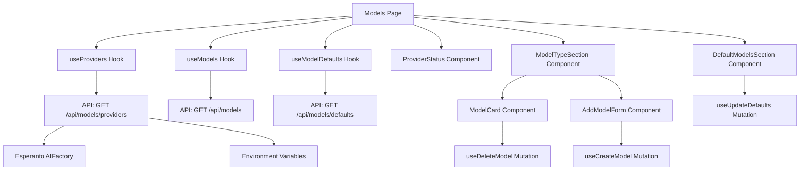

# Model Management Feature - Architecture

## System Overview

### Current State
The Open Notebook system has a three-layer architecture:
1. **Frontend**: React/Next.js with shadcn/ui components
2. **API**: FastAPI backend with REST endpoints
3. **Database**: SurrealDB for data persistence

Model management is currently:
- **Backend**: Fully implemented with CRUD operations and default model management
- **Frontend**: Placeholder page waiting for implementation
- **Provider Check**: Currently done in Streamlit UI via environment variables

### After Implementation
The system will have:
1. **Enhanced API**: New endpoint for provider availability checks
2. **Complete Frontend**: Full model management UI in React
3. **Better Integration**: Provider validation at API level instead of UI level

## Component Architecture

### Backend Components

#### 1. New API Endpoint
```
GET /api/models/providers
```
- **Location**: `/api/routers/models.py`
- **Purpose**: Check provider availability based on environment variables
- **Dependencies**: 
  - Esperanto's `AIFactory.get_available_providers()`
  - Environment variable checks
- **Response Format**:
```json
{
  "available": ["openai", "anthropic", "ollama"],
  "unavailable": ["groq", "mistral"],
  "supported_types": {
    "openai": ["language", "embedding", "text_to_speech", "speech_to_text"],
    "anthropic": ["language"],
    "ollama": ["language", "embedding"]
  }
}
```

### Frontend Components

#### 1. API Layer Enhancement
- **File**: `/frontend/src/lib/api/models.ts`
- **Addition**: `getProviders()` method for the new endpoint

#### 2. TypeScript Types
- **File**: `/frontend/src/lib/types/models.ts`
- **Additions**:
  - `ProviderStatus` interface
  - `ModelDefaults` interface update (fix current structure)
  - Provider availability types

#### 3. React Query Hooks
- **File**: `/frontend/src/lib/hooks/use-models.ts`
- **Additions**:
  - `useProviders()` hook
  - `useUpdateDefaults()` mutation

#### 4. Model Management Page
- **File**: `/frontend/src/app/(dashboard)/models/page.tsx`
- **Components**:
  - Main page orchestrator
  - Provider status display
  - Model management by type

#### 5. UI Components
- **Location**: `/frontend/src/app/(dashboard)/models/components/`
- **Components**:
  - `ProviderStatus.tsx` - Display available/unavailable providers
  - `ModelTypeSection.tsx` - Group models by type with add/delete
  - `AddModelForm.tsx` - Form for adding new models
  - `DefaultModelsSection.tsx` - Set default models
  - `ModelCard.tsx` - Individual model display with actions

## Relationships and Dependencies



## Patterns and Best Practices

### Following Existing Patterns
1. **React Query**: All data fetching uses React Query with proper caching
2. **shadcn/ui**: UI components follow the established design system
3. **Form Handling**: React Hook Form with Zod validation
4. **Error Handling**: Toast notifications for user feedback
5. **Loading States**: Proper loading indicators during async operations

### API Pattern
- RESTful endpoints with proper HTTP methods
- Consistent error responses
- Bearer token authentication
- Request/response validation with Pydantic

### Frontend Pattern
- Hooks for data fetching and mutations
- Component composition for reusability
- TypeScript for type safety
- Responsive design with Tailwind CSS

## External Dependencies
No new external dependencies required. Using:
- Existing: Esperanto (for provider checks)
- Existing: React Query, React Hook Form, shadcn/ui
- Existing: FastAPI, Pydantic

## Constraints and Assumptions

### Constraints
1. Must maintain backward compatibility with existing API
2. Provider availability depends on environment variables
3. Only providers with configured API keys can be used
4. Model types are fixed: language, embedding, text_to_speech, speech_to_text

### Assumptions
1. Environment variables follow existing naming convention (e.g., OPENAI_API_KEY)
2. Esperanto library correctly reports supported model types
3. Users understand which models work with which providers
4. Default models are globally set (not per-user)

## Trade-offs and Alternatives

### Chosen Approach
- **Provider check at API level**: Better security, single source of truth
- **Grouped by model type**: Matches Streamlit UI, logical organization
- **Real-time validation**: Immediate feedback on provider availability

### Alternatives Considered
1. **Client-side env checks**: Rejected - security risk, would expose API keys
2. **Flat model list**: Rejected - harder to navigate with many models
3. **Lazy provider checks**: Rejected - better UX to show availability upfront

## Implementation Impact

### Positive
- Consistent model management across UI and API
- Better validation prevents invalid configurations
- Improved UX with shadcn/ui components
- Type safety throughout the stack

### Negative Consequences
- None identified - this is filling a gap in the current system

## Files to be Modified/Created

### Backend
1. **Modify**: `/api/routers/models.py` - Add provider endpoint
2. **Modify**: `/api/models.py` - Add provider response models

### Frontend
1. **Modify**: `/frontend/src/lib/api/models.ts` - Add provider methods
2. **Modify**: `/frontend/src/lib/types/models.ts` - Update types
3. **Modify**: `/frontend/src/lib/hooks/use-models.ts` - Add hooks
4. **Replace**: `/frontend/src/app/(dashboard)/models/page.tsx` - Full implementation
5. **Create**: `/frontend/src/app/(dashboard)/models/components/ProviderStatus.tsx`
6. **Create**: `/frontend/src/app/(dashboard)/models/components/ModelTypeSection.tsx`
7. **Create**: `/frontend/src/app/(dashboard)/models/components/AddModelForm.tsx`
8. **Create**: `/frontend/src/app/(dashboard)/models/components/DefaultModelsSection.tsx`
9. **Create**: `/frontend/src/app/(dashboard)/models/components/ModelCard.tsx`