# Open Notebook - Mermaid Architecture Diagrams

## 1. Overall Three-Tier Architecture

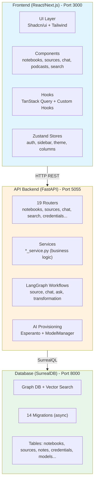

---

## 2. Frontend Module Structure

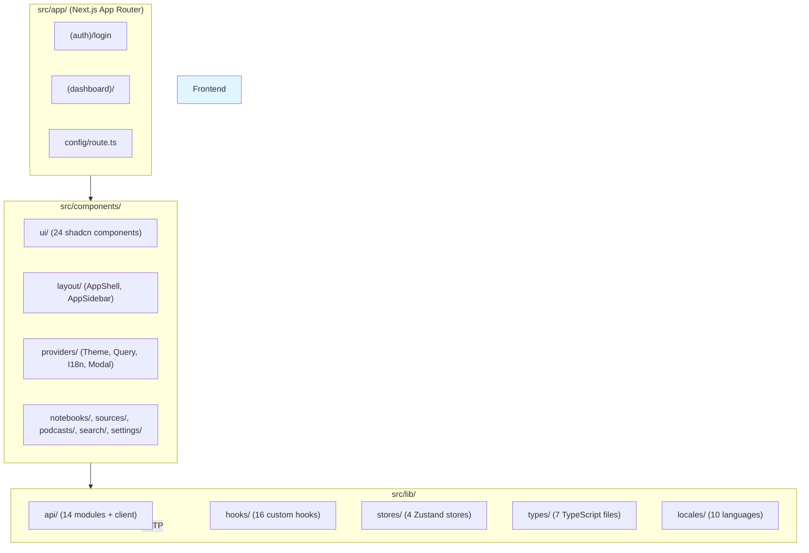

---

## 3. API Backend Structure

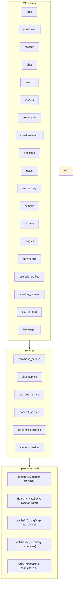

---

## 4. LangGraph Workflows

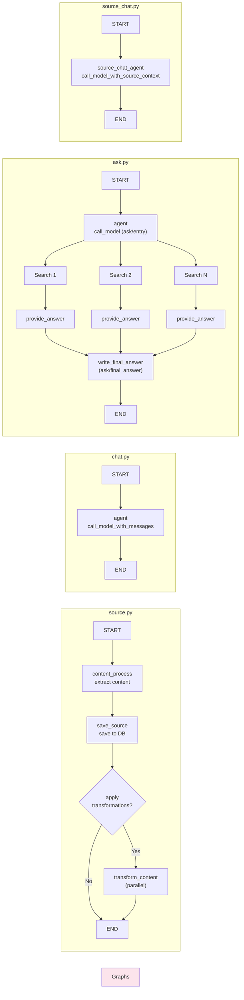

---

## 5. Data Flow: Source Upload to Chat

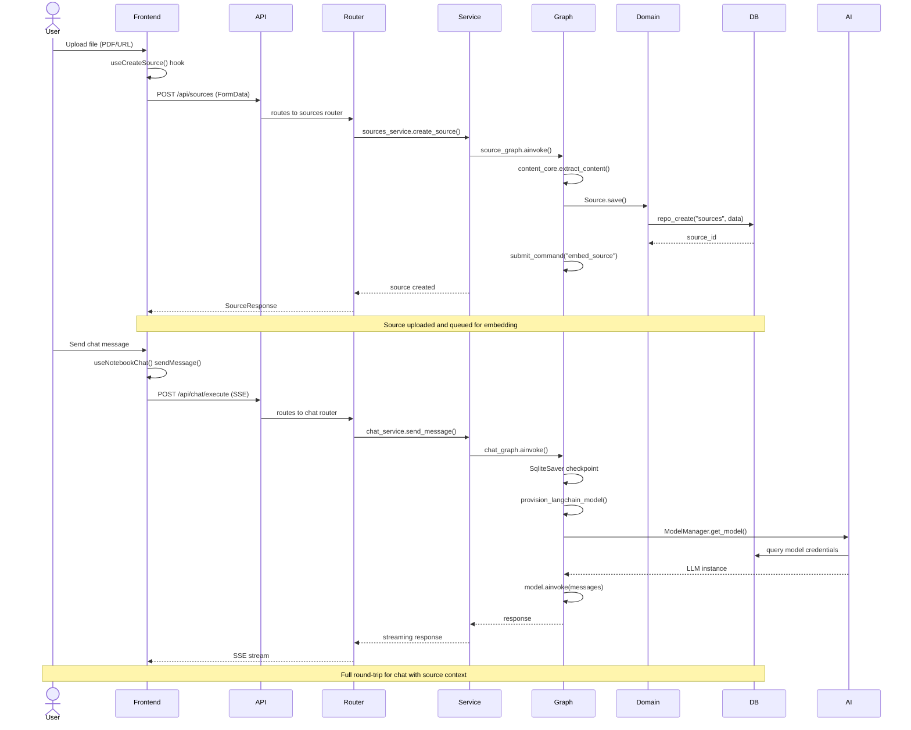

---

## 6. Domain Model Hierarchy

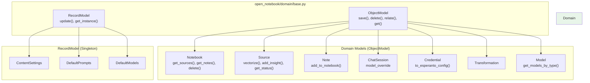

---

## 7. AI Provisioning Flow

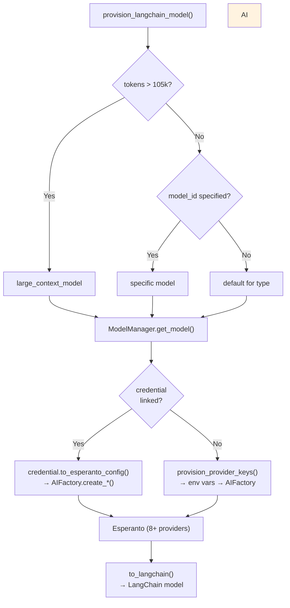

---

## 8. Database Repository Pattern

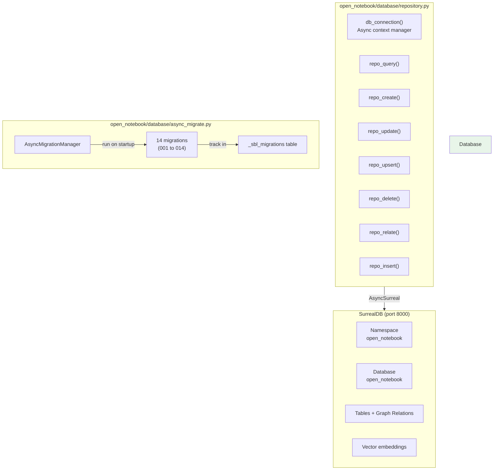

---

## 9. Async Job Command Flow

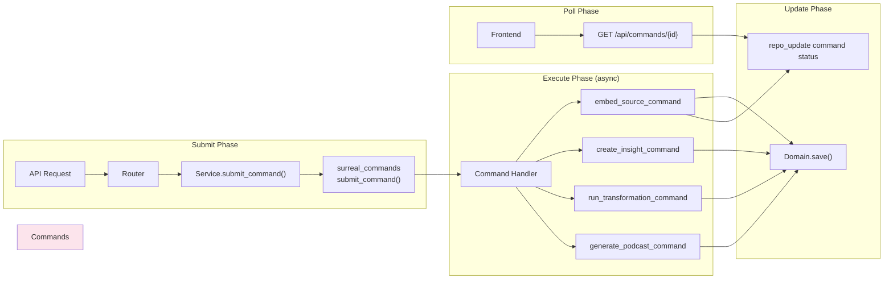

---

## 10. Frontend State Management

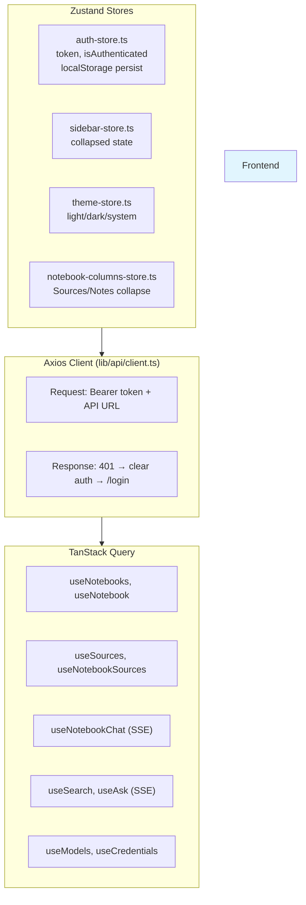

---

## 11. Error Handling Flow

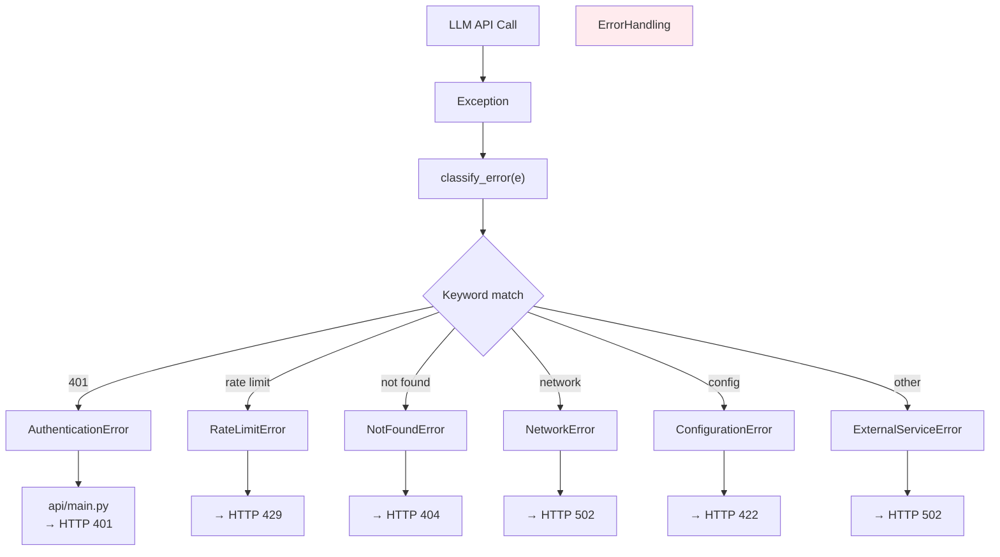

---

## 12. Content Processing Pipeline

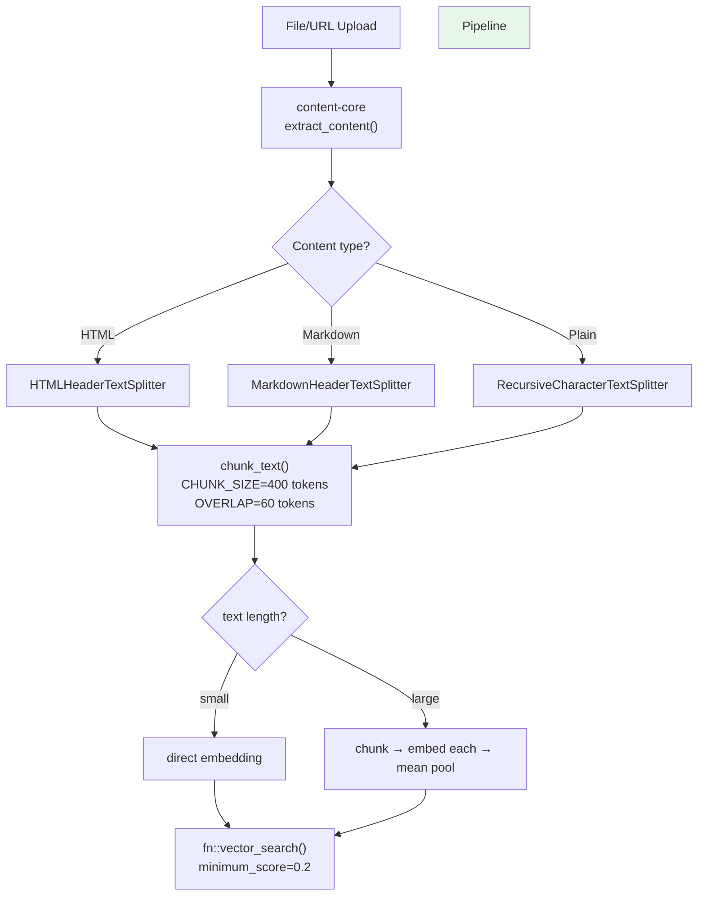

---

## 13. Multi-Provider AI (Esperanto)

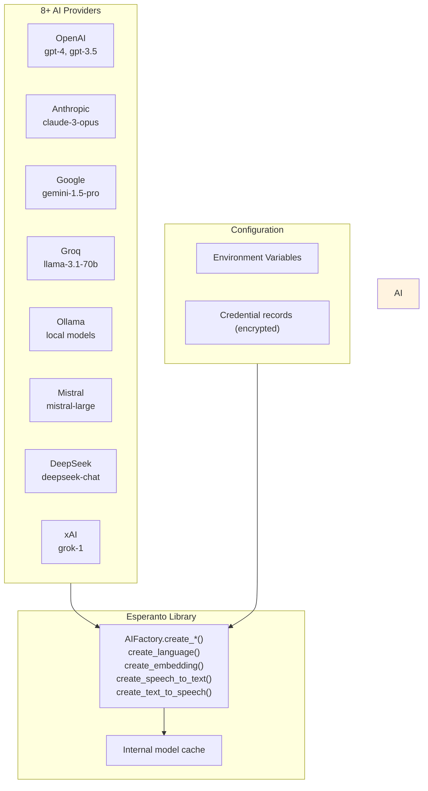

---

## 14. File Upload Flow

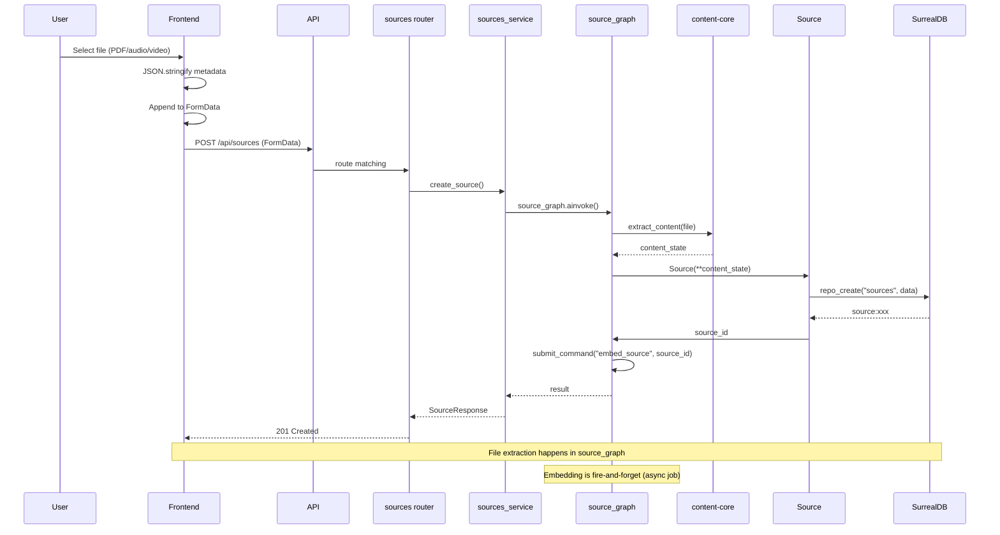

---

## 15. Search + Ask Flow

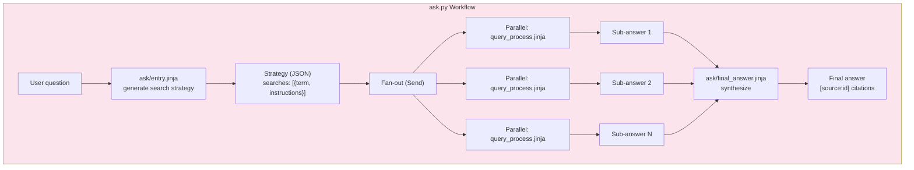

---

## 16. Podcast Generation Flow

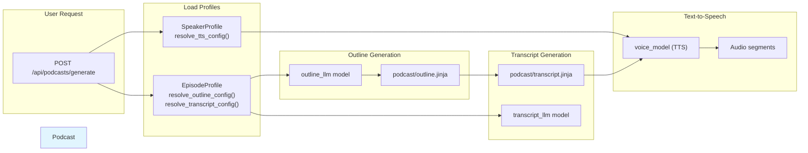

---

## 17. Credential Encryption Flow

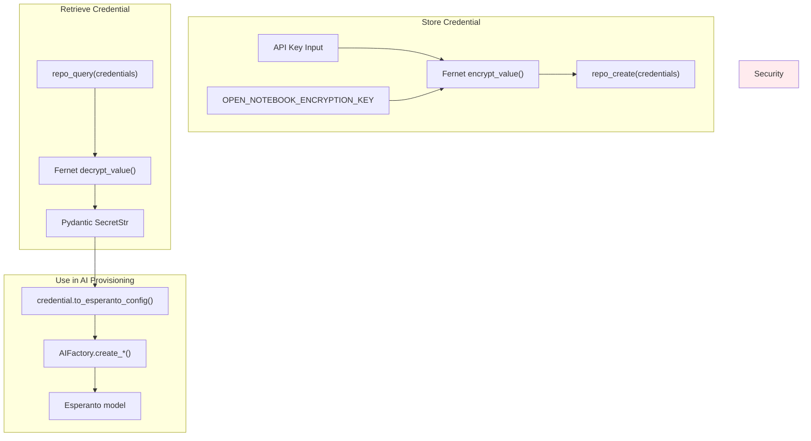

---

## 18. Project Directory Tree (Mermaid)

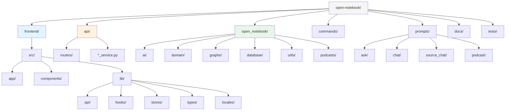