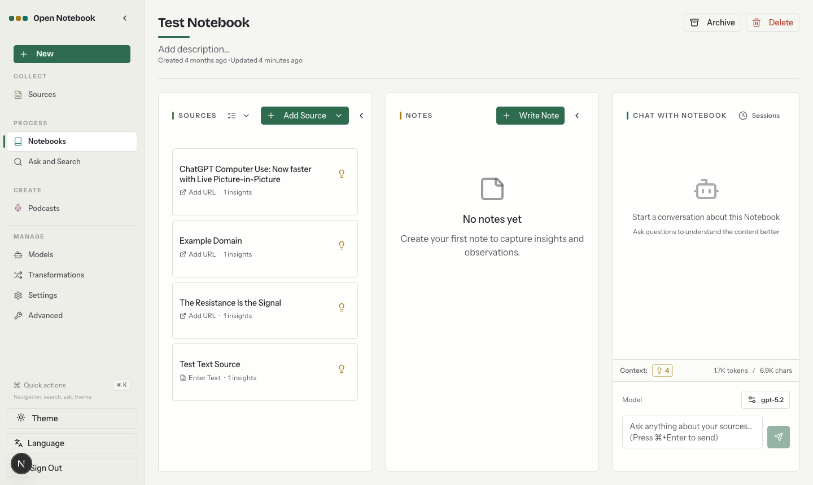

<a id="readme-top"></a>

<!-- [![Contributors][contributors-shield]][contributors-url] -->
[![Forks][forks-shield]][forks-url]
[![Stargazers][stars-shield]][stars-url]
[![Issues][issues-shield]][issues-url]
[![MIT License][license-shield]][license-url]
<!-- [![LinkedIn][linkedin-shield]][linkedin-url] -->


<!-- PROJECT LOGO -->
<br />
<div align="center">
  <a href="https://github.com/lfnovo/open-notebook">
    
  </a>

  <h3 align="center">Open Notebook</h3>

  <p align="center">
    An open source, privacy-focused alternative to Google's Notebook LM!
    <br /><strong>Join our <a href="https://discord.gg/37XJPXfz2w">Discord server</a> for help, to share workflow ideas, and suggest features!</strong>
    <br />
    <a href="https://www.open-notebook.ai"><strong>Checkout our website »</strong></a>
    <br />
    Follow <a href="https://x.com/lfnovo">@lfnovo on X</a> for updates
    <br />
    <br />
    <a href="docs/0-START-HERE/index.md">📚 Get Started</a>
    ·
    <a href="docs/3-USER-GUIDE/index.md">📖 User Guide</a>
    ·
    <a href="docs/2-CORE-CONCEPTS/index.md">✨ Features</a>
    ·
    <a href="docs/1-INSTALLATION/index.md">🚀 Deploy</a>
  </p>
</div>

<p align="center">
<a href="https://trendshift.io/repositories/14536" target="_blank"></a>
</p>

<div align="center">
  <!-- Keep these links. Translations will automatically update with the README. -->
  <a href="https://zdoc.app/de/lfnovo/open-notebook">Deutsch</a> | 
  <a href="https://zdoc.app/es/lfnovo/open-notebook">Español</a> | 
  <a href="https://zdoc.app/fr/lfnovo/open-notebook">français</a> | 
  <a href="https://zdoc.app/ja/lfnovo/open-notebook">日本語</a> | 
  <a href="https://zdoc.app/ko/lfnovo/open-notebook">한국어</a> | 
  <a href="https://zdoc.app/pt/lfnovo/open-notebook">Português</a> | 
  <a href="https://zdoc.app/ru/lfnovo/open-notebook">Русский</a> | 
  <a href="https://zdoc.app/zh/lfnovo/open-notebook">中文</a>
</div>

## A private, multi-model, 100% local, full-featured alternative to Notebook LM



In a world dominated by Artificial Intelligence, having the ability to think 🧠 and acquire new knowledge 💡, is a skill that should not be a privilege for a few, nor restricted to a single provider.

**Open Notebook empowers you to:**
- 🔒 **Control your data** - Keep your research private and secure
- 🤖 **Choose your AI models** - Support for 18+ providers including OpenAI, Anthropic, Ollama, LM Studio, and more
- 📚 **Organize multi-modal content** - PDFs, videos, audio, web pages, and more
- 🎙️ **Generate professional podcasts** - Advanced multi-speaker podcast generation
- 🔍 **Search intelligently** - Full-text and vector search across all your content
- 💬 **Chat with context** - AI conversations powered by your research
- 🌐 **Multi-language UI** - English, Portuguese, Chinese (Simplified & Traditional), Japanese, Russian, and Bengali support

Learn more about our project at [https://www.open-notebook.ai](https://www.open-notebook.ai)

---

## 🆚 Open Notebook vs Google Notebook LM

| Feature | Open Notebook | Google Notebook LM | Advantage |
|---------|---------------|--------------------|-----------|
| **Privacy & Control** | Self-hosted, your data | Google cloud only | Complete data sovereignty |
| **AI Provider Choice** | 18+ providers (OpenAI, Anthropic, Ollama, LM Studio, etc.) | Google models only | Flexibility and cost optimization |
| **Podcast Speakers** | 1-4 speakers with custom profiles | 2 speakers only | Extreme flexibility |
| **Content Transformations** | Custom and built-in | Limited options | Unlimited processing power |
| **API Access** | Full REST API | No API | Complete automation |
| **Deployment** | Docker, cloud, or local | Google hosted only | Deploy anywhere |
| **Citations** | Basic references (will improve) | Comprehensive with sources | Research integrity |
| **Customization** | Open source, fully customizable | Closed system | Unlimited extensibility |
| **Cost** | Pay only for AI usage | Free tier + Monthly subscription | Transparent and controllable |

**Why Choose Open Notebook?**
- 🔒 **Privacy First**: Your sensitive research stays completely private
- 💰 **Cost Control**: Choose cheaper AI providers or run locally with Ollama
- 🎙️ **Better Podcasts**: Full script control and multi-speaker flexibility vs limited 2-speaker deep-dive format
- 🔧 **Unlimited Customization**: Modify, extend, and integrate as needed
- 🌐 **No Vendor Lock-in**: Switch providers, deploy anywhere, own your data

### Built With

[![Python][Python]][Python-url] [![Next.js][Next.js]][Next-url] [![React][React]][React-url] [![SurrealDB][SurrealDB]][SurrealDB-url] [![LangChain][LangChain]][LangChain-url]

## 🚀 Quick Start (2 Minutes)

### Prerequisites
- [Docker Desktop](https://www.docker.com/products/docker-desktop/) installed
- That's it! (API keys configured later in the UI)

### Step 1: Get docker-compose.yml

**Option A:** Download directly
```bash
curl -o docker-compose.yml https://raw.githubusercontent.com/lfnovo/open-notebook/main/docker-compose.yml
```

**Option B:** Create the file manually
Copy this into a new file called `docker-compose.yml`:

```yaml
services:
  surrealdb:
    image: surrealdb/surrealdb:v2
    # Credentials default to root:root for a zero-config local setup. Before
    # exposing this instance to a network, set SURREAL_USER / SURREAL_PASSWORD
    # in a .env file (see .env.example) — they are applied here and to the
    # open_notebook service below, so the two always stay in sync.
    # List (exec) form so each interpolated value stays a single argument —
    # a password containing spaces would otherwise be split into several.
    command: ["start", "--log", "info", "--user", "${SURREAL_USER:-root}", "--pass", "${SURREAL_PASSWORD:-root}", "rocksdb:/mydata/mydatabase.db"]
    user: root  # Required for bind mounts on Linux
    ports:
      # Bound to localhost only: the open_notebook service reaches this over
      # the internal compose network regardless, so the host port is purely
      # for local debugging (e.g. Surrealist, `surreal sql`). Exposing this
      # on 0.0.0.0 would let anyone who can reach the host connect with the
      # default root:root credentials.
      - "127.0.0.1:8000:8000"
    volumes:
      - ./surreal_data:/mydata
    environment:
      - SURREAL_EXPERIMENTAL_GRAPHQL=true
    restart: always
    pull_policy: always

  open_notebook:
    image: lfnovo/open_notebook:v1-latest
    ports:
      - "8502:8502"  # Web UI
      - "5055:5055"  # REST API
    environment:
      # REQUIRED: Change this to your own secret string
      # This encrypts your API keys in the database
      - OPEN_NOTEBOOK_ENCRYPTION_KEY=change-me-to-a-secret-string

      # Database connection. SURREAL_USER / SURREAL_PASSWORD default to root:root
      # for local use; override them in a .env file before exposing the instance
      # (the same values configure the surrealdb service above).
      - SURREAL_URL=ws://surrealdb:8000/rpc
      - SURREAL_USER=${SURREAL_USER:-root}
      - SURREAL_PASSWORD=${SURREAL_PASSWORD:-root}
      - SURREAL_NAMESPACE=open_notebook
      - SURREAL_DATABASE=open_notebook
    volumes:
      - ./notebook_data:/app/data
    depends_on:
      - surrealdb
    restart: always
    pull_policy: always
```

### Step 2: Set Your Encryption Key
Edit `docker-compose.yml` and change this line:
```yaml
- OPEN_NOTEBOOK_ENCRYPTION_KEY=change-me-to-a-secret-string
```
to any secret value (e.g., `my-super-secret-key-123`)

### Step 3: Start Services
```bash
docker compose up -d
```

Wait 15-20 seconds, then open: **http://localhost:8502**

### Step 4: Configure AI Provider
1. Go to **Models** and choose your provider (OpenAI, Anthropic, Google, etc.)
2. Click **+ Add Configuration**
3. Paste your API key and other info as needed and click **Add Configuration**
4. Click **Test** to test connection
5. Click **Sync Models** and check models to include
6. Under **Default Model Assignments**, click **Auto-Assign Defaults** or manually specify which models to use for what 

Done! You're ready to create your first notebook.

> **Need an API key?** Get one from:
> [OpenAI](https://platform.openai.com/api-keys) · [Anthropic](https://console.anthropic.com/) · [Google](https://aistudio.google.com/) · [Groq](https://console.groq.com/) (free tier)

> **Want free local AI?** See [examples/docker-compose-ollama.yml](examples/) for Ollama setup

---

### 📚 More Installation Options

- **[With Ollama (Free Local AI)](examples/docker-compose-ollama.yml)** - Run models locally without API costs
- **[From Source (Developers)](docs/1-INSTALLATION/from-source.md)** - For development and contributions
- **[Complete Installation Guide](docs/1-INSTALLATION/index.md)** - All deployment scenarios

---

### 📖 Need Help?

- **🤖 AI Installation Assistant**: [CustomGPT to help you install](https://chatgpt.com/g/g-68776e2765b48191bd1bae3f30212631-open-notebook-installation-assistant)
- **🆘 Troubleshooting**: [5-minute troubleshooting guide](docs/6-TROUBLESHOOTING/quick-fixes.md)
- **💬 Community Support**: [Discord Server](https://discord.gg/37XJPXfz2w)
- **🐛 Report Issues**: [GitHub Issues](https://github.com/lfnovo/open-notebook/issues)

---

## Star History

[](https://star-history.dera.page/#lfnovo/open-notebook&type=date&legend=top-left)


## Provider Support Matrix

Thanks to the [Esperanto](https://github.com/lfnovo/esperanto) library, we support this providers out of the box!

| Provider     | LLM Support | Embedding Support | Speech-to-Text | Text-to-Speech |
|--------------|-------------|------------------|----------------|----------------|
| OpenAI       | ✅          | ✅               | ✅             | ✅             |
| Anthropic    | ✅          | ❌               | ❌             | ❌             |
| Groq         | ✅          | ❌               | ✅             | ❌             |
| Google (GenAI) | ✅          | ✅               | ✅             | ✅             |
| Vertex AI    | ✅          | ✅               | ❌             | ✅             |
| Ollama       | ✅          | ✅               | ❌             | ❌             |
| oMLX         | ✅          | ✅               | ❌             | ❌             |
| Perplexity   | ✅          | ❌               | ❌             | ❌             |
| ElevenLabs   | ❌          | ❌               | ✅             | ✅             |
| Deepgram     | ❌          | ❌               | ✅             | ✅             |
| Azure OpenAI | ✅          | ✅               | ✅             | ✅             |
| Mistral      | ✅          | ✅               | ✅             | ✅             |
| DeepSeek     | ✅          | ❌               | ❌             | ❌             |
| Cohere       | ✅          | ✅               | ❌             | ❌             |
| Voyage       | ❌          | ✅               | ❌             | ❌             |
| xAI          | ✅          | ❌               | ❌             | ✅             |
| OpenRouter   | ✅          | ✅               | ✅             | ✅             |
| DashScope (Qwen) | ✅          | ❌               | ❌             | ❌             |
| MiniMax      | ✅          | ❌               | ❌             | ❌             |
| Novita       | ✅          | ❌               | ❌             | ❌             |
| PayPerQ (PPQ) | ✅          | ✅               | ✅             | ✅             |
| OpenAI Compatible* | ✅          | ✅               | ✅             | ✅             |

*Supports LM Studio and any OpenAI-compatible endpoint. Prefer the native **oMLX** provider for [oMLX](https://omlx.ai/) (Apple Silicon); see [docs/5-CONFIGURATION/omlx.md](docs/5-CONFIGURATION/omlx.md).

## ✨ Key Features

### Core Capabilities
- **🔒 Privacy-First**: Your data stays under your control - no cloud dependencies
- **🎯 Multi-Notebook Organization**: Manage multiple research projects seamlessly
- **📚 Universal Content Support**: PDFs, videos, audio, web pages, Office docs, and more
- **🤖 Multi-Model AI Support**: 18+ providers including OpenAI, Anthropic, Ollama, Google, LM Studio, and more
- **🎙️ Professional Podcast Generation**: Advanced multi-speaker podcasts with Episode Profiles
- **🔍 Intelligent Search**: Full-text and vector search across all your content
- **💬 Context-Aware Chat**: AI conversations powered by your research materials
- **📝 AI-Assisted Notes**: Generate insights or write notes manually

### Advanced Features
- **⚡ Reasoning Model Support**: Full support for thinking models like DeepSeek-R1 and Qwen3
- **🔧 Content Transformations**: Powerful customizable actions to summarize and extract insights
- **🌐 Comprehensive REST API**: Full programmatic access for custom integrations [](http://localhost:5055/docs)
- **🔐 Optional Password Protection**: Secure public deployments with authentication
- **📊 Fine-Grained Context Control**: Choose exactly what to share with AI models
- **📎 Citations**: Get answers with proper source citations


## Podcast Feature

[](https://www.youtube.com/watch?v=D-760MlGwaI)

## 📚 Documentation

### Getting Started
- **[📖 Introduction](docs/0-START-HERE/index.md)** - Learn what Open Notebook offers
- **[⚡ Quick Start with OpenAI](docs/0-START-HERE/quick-start-openai.md)** - Get up and running in 5 minutes
- **[🔧 Installation](docs/1-INSTALLATION/index.md)** - Comprehensive setup guide
- **[🎯 Run It Fully Local](docs/0-START-HERE/quick-start-local.md)** - Ollama/LM Studio, completely private

### User Guide
- **[📱 Interface Overview](docs/3-USER-GUIDE/interface-overview.md)** - Understanding the layout
- **[📚 Notebooks, Sources & Notes](docs/2-CORE-CONCEPTS/notebooks-sources-notes.md)** - Organizing your research
- **[📄 Adding Sources](docs/3-USER-GUIDE/adding-sources.md)** - Managing content types
- **[📝 Working with Notes](docs/3-USER-GUIDE/working-with-notes.md)** - Creating and managing notes
- **[💬 Chatting Effectively](docs/3-USER-GUIDE/chat-effectively.md)** - AI conversations
- **[🔍 Search](docs/3-USER-GUIDE/search.md)** - Finding information

### Advanced Topics
- **[🎙️ Podcast Generation](docs/2-CORE-CONCEPTS/podcasts-explained.md)** - Create professional podcasts
- **[🔧 Content Transformations](docs/3-USER-GUIDE/transformations.md)** - Customize content processing
- **[🤖 AI Models](docs/4-AI-PROVIDERS/index.md)** - AI model configuration
- **[🔌 MCP Integration](docs/5-CONFIGURATION/mcp-integration.md)** - Connect with Claude Desktop, VS Code and other MCP clients
- **[🔧 REST API Reference](docs/7-DEVELOPMENT/api-reference.md)** - Complete API documentation
- **[🔐 Security](docs/5-CONFIGURATION/security.md)** - Password protection and privacy
- **[🚀 Deployment](docs/1-INSTALLATION/index.md)** - Complete deployment guides for all scenarios
- **[🧭 Vision & Principles](VISION.md)** - What Open Notebook is, and where it's going
- **[🛠️ Developer Docs](docs/7-DEVELOPMENT/index.md)** - Architecture, setup, contributing, decision records

<p align="right">(<a href="#readme-top">back to top</a>)</p>

## 🗺️ Roadmap

### Upcoming Features
- **Live Front-End Updates**: Real-time UI updates for smoother experience
- **Async Processing**: Faster UI through asynchronous content processing
- **Cross-Notebook Sources**: Reuse research materials across projects
- **Bookmark Integration**: Connect with your favorite bookmarking apps

### Recently Completed ✅
- **Next.js Frontend**: Modern React-based frontend with improved performance
- **Comprehensive REST API**: Full programmatic access to all functionality
- **Multi-Model Support**: 18+ AI providers including OpenAI, Anthropic, Ollama, LM Studio
- **Advanced Podcast Generator**: Professional multi-speaker podcasts with Episode Profiles
- **Content Transformations**: Powerful customizable actions for content processing
- **Enhanced Citations**: Improved layout and finer control for source citations
- **Multiple Chat Sessions**: Manage different conversations within notebooks

Explore [GitHub Discussions](https://github.com/lfnovo/open-notebook/discussions/categories/ideas) for proposed features and product ideas, and [open Issues](https://github.com/lfnovo/open-notebook/issues) for known bugs and approved work.

<p align="right">(<a href="#readme-top">back to top</a>)</p>


## 📖 Need Help?
- **🤖 AI Installation Assistant**: We have a [CustomGPT built to help you install Open Notebook](https://chatgpt.com/g/g-68776e2765b48191bd1bae3f30212631-open-notebook-installation-assistant) - it will guide you through each step!
- **New to Open Notebook?** Start with our [Getting Started Guide](docs/0-START-HERE/index.md)
- **Need installation help?** Check our [Installation Guide](docs/1-INSTALLATION/index.md)
- **Want to see it in action?** Try our [Quick Start Tutorial](docs/0-START-HERE/index.md)

## 🤝 Community & Contributing

### Join the Community
- 💬 **[Discord Server](https://discord.gg/37XJPXfz2w)** - Get help, share ideas, and connect with other users
- 𝕏 **[Follow @lfnovo on X](https://x.com/lfnovo)** - Project updates and news from the maintainer
- 💡 **[GitHub Discussions](https://github.com/lfnovo/open-notebook/discussions)** - Ask questions and shape features, product direction, design, and architecture
- 🐛 **[GitHub Issues](https://github.com/lfnovo/open-notebook/issues)** - Report reproducible bugs and find approved work
- ⭐ **Star this repo** - Show your support and help others discover Open Notebook

### Contributing
We welcome contributions! We're especially looking for help with:
- **Frontend Development**: Help improve our modern Next.js/React UI
- **Testing & Bug Fixes**: Make Open Notebook more robust
- **Feature Development**: Build the coolest research tool together
- **Documentation**: Improve guides and tutorials

**Current Tech Stack**: Python, FastAPI, Next.js, React, SurrealDB
**Future Roadmap**: Real-time updates, enhanced async processing

See our [Contributing Guide](CONTRIBUTING.md) for detailed information on how to get started, including our guidelines for [AI-assisted contributions](docs/7-DEVELOPMENT/contributing.md#ai-assisted-and-agent-generated-prs). To understand what we're building (and what we'll say no to), read [VISION.md](VISION.md).

<p align="right">(<a href="#readme-top">back to top</a>)</p>


## 📄 License

Open Notebook is MIT licensed. See the [LICENSE](LICENSE) file for details.


**Community Support**:
- 💬 [Discord Server](https://discord.gg/37XJPXfz2w) - Get help, share ideas, and connect with users
- 𝕏 [Follow @lfnovo on X](https://x.com/lfnovo) - Project updates and news from the maintainer
- 💡 [GitHub Discussions](https://github.com/lfnovo/open-notebook/discussions) - Ask questions and shape ideas
- 🐛 [GitHub Issues](https://github.com/lfnovo/open-notebook/issues) - Report reproducible bugs and find approved work
- 🌐 [Website](https://www.open-notebook.ai) - Learn more about the project

<p align="right">(<a href="#readme-top">back to top</a>)</p>


<!-- MARKDOWN LINKS & IMAGES -->
<!-- https://www.markdownguide.org/basic-syntax/#reference-style-links -->
[contributors-shield]: https://img.shields.io/github/contributors/lfnovo/open-notebook.svg?style=for-the-badge
[contributors-url]: https://github.com/lfnovo/open-notebook/graphs/contributors
[forks-shield]: https://img.shields.io/github/forks/lfnovo/open-notebook.svg?style=for-the-badge
[forks-url]: https://github.com/lfnovo/open-notebook/network/members
[stars-shield]: https://img.shields.io/github/stars/lfnovo/open-notebook.svg?style=for-the-badge
[stars-url]: https://github.com/lfnovo/open-notebook/stargazers
[issues-shield]: https://img.shields.io/github/issues/lfnovo/open-notebook.svg?style=for-the-badge
[issues-url]: https://github.com/lfnovo/open-notebook/issues
[license-shield]: https://img.shields.io/github/license/lfnovo/open-notebook.svg?style=for-the-badge
[license-url]: https://github.com/lfnovo/open-notebook/blob/master/LICENSE.txt
[linkedin-shield]: https://img.shields.io/badge/-LinkedIn-black.svg?style=for-the-badge&logo=linkedin&colorB=555
[linkedin-url]: https://linkedin.com/in/lfnovo
[product-screenshot]: images/screenshot.png
[Next.js]: https://img.shields.io/badge/Next.js-000000?style=for-the-badge&logo=next.js&logoColor=white
[Next-url]: https://nextjs.org/
[React]: https://img.shields.io/badge/React-61DAFB?style=for-the-badge&logo=react&logoColor=black
[React-url]: https://reactjs.org/
[Python]: https://img.shields.io/badge/Python-3776AB?style=for-the-badge&logo=python&logoColor=white
[Python-url]: https://www.python.org/
[LangChain]: https://img.shields.io/badge/LangChain-3A3A3A?style=for-the-badge&logo=chainlink&logoColor=white
[LangChain-url]: https://www.langchain.com/
[SurrealDB]: https://img.shields.io/badge/SurrealDB-FF5E00?style=for-the-badge&logo=databricks&logoColor=white
[SurrealDB-url]: https://surrealdb.com/


## 🌐 Web Resources & Interactive Index
- [ZOMBIES WEAPON MERGE 4](https://themindzone.pages.dev/zombies-weapon-merge-4.html)
- [ELITE CHESS](https://themindplays.pages.dev/elite-chess.html)
- [ANGRY CITY SMASHER](https://thelearnquesters.pages.dev/angry-city-smasher.html)
- [CATEGORY TETRIS36](https://iskillplay.web.app/category-tetris36.html)
- [CATEGORY MATCH 3117](https://themindplays.pages.dev/category-match-3117.html)
- [INDEX18](https://skillplay.github.io/index18.html)
- [CATEGORY BATTLE 2](https://thequizzone.pages.dev/category-battle-2.html)
- [TREASURE HUNT PUZZLE](https://themindplays.pages.dev/treasure-hunt-puzzle.html)
- [CATEGORY IDLE448](https://thequizzone.pages.dev/category-idle448.html)
- [JIGSAW M](https://thequizzone.pages.dev/jigsaw-m.html)
- [MONSTER SCHOOL 2](https://thelearnquesters.pages.dev/monster-school-2.html)
- [HYPER WAVE CHALLENGE](https://thelearnquesters.pages.dev/hyper-wave-challenge.html)
- [SNAKE PUZZLE ESCAPE](https://thelearnquesters.pages.dev/snake-puzzle-escape.html)
- [MAKEUP STACK](https://themindplay.pages.dev/makeup-stack.html)
- [SWEET TRIPLE MAHJONG](https://themindplays.pages.dev/sweet-triple-mahjong.html)
- [MONSTER SLAYERS](https://thequizzone.pages.dev/monster-slayers.html)
- [INDEX34](https://themindzone.pages.dev/index34.html)
- [IDLE PET](https://thelearnquesters.pages.dev/idle-pet.html)
- [CATEGORY TOWER DEFENSE118](https://themindplays.pages.dev/category-tower-defense118.html)
- [WAR LANDS](https://themindplays.pages.dev/war-lands.html)
- [FARM OF WORDS](https://themindplaying.web.app/farm-of-words.html)
- [MOSCOW METRO DRIVER 3D](https://thequizzone.pages.dev/moscow-metro-driver-3d.html)
- [SNIPER VS SNIPER](https://themindplays.pages.dev/sniper-vs-sniper.html)
- [XMAS HEXA SORT](https://themindplaying.web.app/xmas-hexa-sort.html)
- [TWILIGHT SOLITAIRE TRIPEAKS](https://themindplays.pages.dev/twilight-solitaire-tripeaks.html)
- [CATEGORY ADVENTURE 5](https://themindplays.pages.dev/category-adventure-5.html)
- [TOILET PIN](https://thequizzone.pages.dev/toilet-pin.html)
- [CATEGORY STICKMAN](https://themindplays.pages.dev/category-stickman.html)
- [CATEGORY BIKE](https://themindplays.pages.dev/category-bike.html)
- [CATEGORY BATTLE](https://thequizzone.pages.dev/category-battle.html)
- [CASTLE CRAFT](https://themindplays.pages.dev/castle-craft.html)
- [CATEGORY BUILDING](https://thequizzone.pages.dev/category-building.html)
- [LABUBU POP](https://themindplay.pages.dev/labubu-pop.html)
- [CATEGORY ARCHERY52](https://themindzone.pages.dev/category-archery52.html)
- [MAX CRUSHER 2 DESTRUCTION DRIFT AND RACING](https://themindplays.pages.dev/max-crusher-2-destruction-drift-and-racing.html)
- [EMOJI SORT FUN PUZZLE GAME](https://thelearnquesters.pages.dev/emoji-sort-fun-puzzle-game.html)
- [SECRETS OF CHARMLAND](https://thequizzone.pages.dev/secrets-of-charmland.html)
- [CATEGORY SHOOTER 2](https://themindplaying.web.app/category-shooter-2.html)
- [DOGE MATCH](https://thequizzone.pages.dev/doge-match.html)
- [CATEGORY DEFENSE176](https://learnquester.pages.dev/category-defense176.html)
- [BALLPOINT](https://thelearnquesters.pages.dev/ballpoint.html)
- [LUCKY BRAINROT BLOCKS ONLINE](https://thelearnquesters.pages.dev/lucky-brainrot-blocks-online.html)
- [CATEGORY MOUSE1 697](https://thequizzone.pages.dev/category-mouse1-697.html)
- [BOUNCEPOP QUEST](https://learnquester.github.io/bouncepop-quest.html)
- [8 BALL POOL BILLIARDS MULTIPLAYER](https://studyplayings.web.app/8-ball-pool-billiards-multiplayer.html)
- [INDEX10](https://themindplays.pages.dev/index10.html)
- [CATEGORY PUZZLE 6](https://studyquesthub.web.app/category-puzzle-6.html)
- [MATCH FIND 3D](https://studyquests.pages.dev/match-find-3d.html)
- [CATEGORY CASUAL 12](https://themindzone.pages.dev/category-casual-12.html)
- [GOO SLIME JUMP](https://studyquests.github.io/goo-slime-jump.html)
- [SNOW RIDER 3D NOSTALGIA](https://studyquests.github.io/snow-rider-3d-nostalgia.html)
- [HOME RUSH THE FISH WAR](https://themindplays.pages.dev/home-rush-the-fish-war.html)
- [MAGICAL DIARY PAPER DRESS UP](https://thequizzone.pages.dev/magical-diary-paper-dress-up.html)
- [MERGE HEROES](https://studyquests.github.io/merge-heroes.html)
- [PRACTICE ON ME](https://studyplaying.github.io/practice-on-me.html)
- [CHESS ONLINE](https://studyquesthub.web.app/chess-online.html)
- [NOOB DRAW PUNCH](https://thelearnquesters.pages.dev/noob-draw-punch.html)
- [MOW IT](https://thequizzone.pages.dev/mow-it.html)
- [OFFROAD JEEP GAME SIMULATOR](https://studyplaying.github.io/offroad-jeep-game-simulator.html)
- [NEW YEAR S EVE MAKEUP](https://thequizzone.pages.dev/new-year-s-eve-makeup.html)
- [SUDOKU BRAIN BLOCKS](https://studyquests.github.io/sudoku-brain-blocks.html)
- [INDEX35](https://themindplays.pages.dev/index35.html)
- [DRIVE TO SURVIVE](https://studyplayings.pages.dev/drive-to-survive.html)
- [WATERMELON MERGE](https://studyplayings.web.app/watermelon-merge.html)
- [CHICKZ STACK](https://studyplaying.github.io/chickz-stack.html)
- [SCARY BANBAN ESCAPE](https://themindplays.pages.dev/scary-banban-escape.html)
- [OBBY PRISON RUN](https://studyquests.github.io/obby-prison-run.html)
- [CATEGORY SHOP](https://studyplayings.web.app/category-shop.html)
- [CATEGORY BUILDING182](https://studyplayings.pages.dev/category-building182.html)
- [ITALIAN BRAINROT PUZZLE](https://studyquesthub.web.app/italian-brainrot-puzzle.html)
- [CATEGORY IO](https://themindplays.pages.dev/category-io.html)
- [ROYAL GARDEN MATCH](https://studyplaying.github.io/royal-garden-match.html)
- [MANSION STORY MATCH](https://studyquests.github.io/mansion-story-match.html)
- [CATEGORY INTERSTELLARPROXY](https://studyquests.github.io/category-interstellarproxy.html)
- [DRAWING SQUARES](https://studyquesthub.web.app/drawing-squares.html)
- [LEAP OF LIFE](https://studyquests.github.io/leap-of-life.html)
- [SITEMAP](https://studyplayings.pages.dev/sitemap.html)
- [PUMPKIN PATCH](https://thequizzone.pages.dev/pumpkin-patch.html)
- [SCREW IT OUT JAM MATCHING COLORED SCREWS](https://themindplays.pages.dev/screw-it-out-jam-matching-colored-screws.html)
- [MONSTER SLAYER MERGE SURVIVE](https://themindplaying.web.app/monster-slayer-merge-survive.html)
- [CATEGORY CASUAL 11](https://studyquests.github.io/category-casual-11.html)
- [CATEGORY BYEPASSHUB](https://studyplayings.pages.dev/category-byepasshub.html)
- [HAWAII MATCH 6](https://themindzone.pages.dev/hawaii-match-6.html)
- [SPINNING UIA UIA CAT BRICKER](https://themindzone.pages.dev/spinning-uia-uia-cat-bricker.html)
- [ONLY UP PARKOUR 2](https://themindplays.pages.dev/only-up-parkour-2.html)
- [PATTERNS](https://themindplays.pages.dev/patterns.html)
- [STACKTRIS 2048](https://themindplays.pages.dev/stacktris-2048.html)
- [ANIMERGE](https://themindplay.pages.dev/animerge.html)
- [MATHEMATICS RACING](https://studyquesthub.web.app/mathematics-racing.html)
- [CATEGORY 2D1 060](https://studyplayings.pages.dev/category-2d1-060.html)
- [INDEX19](https://themindplays.pages.dev/index19.html)
- [INDEX32](https://themindplays.pages.dev/index32.html)
- [MERGE 2048 GUN RUSH](https://themindplays.pages.dev/merge-2048-gun-rush.html)
- [ANTISTRESS RELAXATION BOX](https://theskillquest.pages.dev/antistress-relaxation-box.html)
- [WORD ART COLOR BOOK PUZZLE](https://studyquests.github.io/word-art-color-book-puzzle.html)
- [HAZEL TANGLE ROPE 3D SORTING PUZZLE](https://themindzone.pages.dev/hazel-tangle-rope-3d-sorting-puzzle.html)
- [LAZY WORKERS](https://studyplaying.github.io/lazy-workers.html)
- [YOUR DREAM ROOM](https://themindplays.pages.dev/your-dream-room.html)
- [MIGHTY RUN](https://studyplayings.web.app/mighty-run.html)
- [SIBERIAN ASSAULT](https://studyplayings.web.app/siberian-assault.html)
- [SEADRAGONS IO](https://studyplaying.github.io/seadragons-io.html)
- [DIGITAL CIRCUS FIND THE DIFFERENCES](https://themindplaying.web.app/digital-circus-find-the-differences.html)
- [STICKMAN PUNISHMENT](https://studyquests.github.io/stickman-punishment.html)
- [POP THE BUBBLE](https://studyquests.github.io/pop-the-bubble.html)
- [TAXI DRIVER SIMULATOR](https://themindplays.pages.dev/taxi-driver-simulator.html)
- [LOOPER](https://studyplaying.github.io/looper.html)
- [CATEGORY GITHUB IO](https://studyplayings.pages.dev/category-github-io.html)
- [WINTER MAZE](https://thelearnquesters.pages.dev/winter-maze.html)
- [TIMEWALKER SURVIVE](https://thequizzone.pages.dev/timewalker-survive.html)
- [SOLITAIRE TAIL](https://studyplaying.github.io/solitaire-tail.html)
- [HIDDEN OBJECT GIRL AND CAT](https://themindplaying.web.app/hidden-object-girl-and-cat.html)
- [INDEX7](https://themindplays.pages.dev/index7.html)
- [INDEX8](https://themindplays.pages.dev/index8.html)
- [AROUND ELBRUS](https://studyquests.github.io/around-elbrus.html)
- [CANDY LOVE](https://themindzone.pages.dev/candy-love.html)
- [STUNT CAR EXTREME 2](https://studyquests.github.io/stunt-car-extreme-2.html)
- [ANACONDA RUNNER](https://themindplays.pages.dev/anaconda-runner.html)
- [SUPER TANK WRESTLE](https://studyplaying.github.io/super-tank-wrestle.html)
- [CANDY MAKER DESSERT GAMES](https://themindzone.pages.dev/candy-maker-dessert-games.html)
- [BRAINROT A DIFFERENCE CHALLENGE](https://studyquesthub.web.app/brainrot-a-difference-challenge.html)
- [HERO STORY MONSTERS CROSSING](https://studyplayings.web.app/hero-story-monsters-crossing.html)
- [RIFT OF HELL DEMONS WAR](https://thequizzone.pages.dev/rift-of-hell-demons-war.html)
- [BRAIN TEST ONE LINE DRAW PUZZLE](https://themindzone.pages.dev/brain-test-one-line-draw-puzzle.html)
- [ROOM SORT FLOOR PLAN](https://studyquesthub.web.app/room-sort-floor-plan.html)
- [BUBBLE TROUBLE 2 REBUBBLED](https://studyplayings.web.app/bubble-trouble-2-rebubbled.html)
- [CATEGORY CAN T STOP PLAYING215](https://themindplaying.web.app/category-can-t-stop-playing215.html)
- [FORMULA RACING GAMES CAR GAME](https://studyplayings.web.app/formula-racing-games-car-game.html)
- [HOME DESIGN SMALL HOUSE](https://studyplayings.web.app/home-design-small-house.html)
- [CATEGORY PUZZLE 4](https://studyquests.pages.dev/category-puzzle-4.html)
- [TERMS](https://themindplaying.web.app/terms.html)
