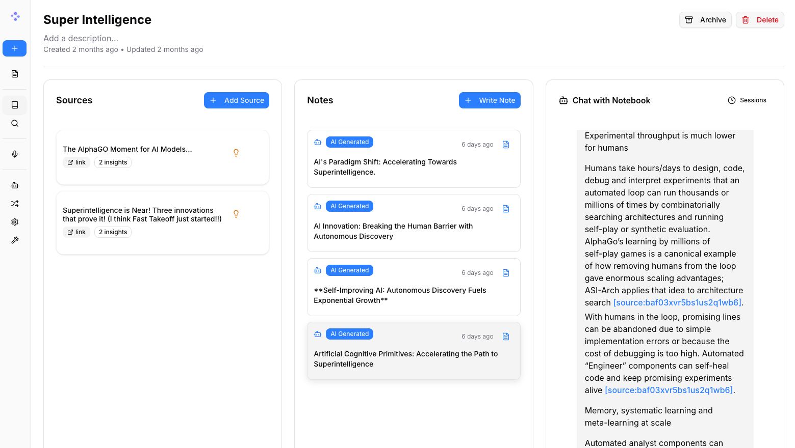

<a id="readme-top"></a>

<!-- [![Contributors][contributors-shield]][contributors-url] -->
[![Forks][forks-shield]][forks-url]
[![Stargazers][stars-shield]][stars-url]
[![Issues][issues-shield]][issues-url]
[![MIT License][license-shield]][license-url]
<!-- [![LinkedIn][linkedin-shield]][linkedin-url] -->


<!-- プロジェクトロゴ -->
<br />
<div align="center">
  <a href="https://github.com/lfnovo/open-notebook">
    
  </a>

  <h3 align="center">Open Notebook</h3>

  <p align="center">
    Google Notebook LMのオープンソース・プライバシー重視の代替ツール！
    <br /><strong><a href="https://discord.gg/37XJPXfz2w">Discordサーバー</a>に参加して、ヘルプの取得、ワークフローのアイデア共有、機能提案をしましょう！</strong>
    <br />
    <a href="https://www.open-notebook.ai"><strong>公式ウェブサイトはこちら »</strong></a>
    <br />
    <br />
    <a href="docs/getting-started/index.md">📚 はじめる</a>
    ·
    <a href="docs/user-guide/index.md">📖 ユーザーガイド</a>
    ·
    <a href="docs/features/index.md">✨ 機能</a>
    ·
    <a href="docs/deployment/index.md">🚀 デプロイ</a>
  </p>
</div>

<p align="center">
<a href="https://trendshift.io/repositories/14536" target="_blank"></a>
</p>

<div align="center">
  <!-- これらのリンクを保持してください。翻訳はREADMEと自動的に更新されます。 -->
  <a href="README.md">English</a> |
  <a href="https://zdoc.app/de/lfnovo/open-notebook">Deutsch</a> |
  <a href="https://zdoc.app/es/lfnovo/open-notebook">Español</a> |
  <a href="https://zdoc.app/fr/lfnovo/open-notebook">français</a> |
  <strong>日本語</strong> |
  <a href="https://zdoc.app/ko/lfnovo/open-notebook">한국어</a> |
  <a href="https://zdoc.app/pt/lfnovo/open-notebook">Português</a> |
  <a href="https://zdoc.app/ru/lfnovo/open-notebook">Русский</a> |
  <a href="https://zdoc.app/zh/lfnovo/open-notebook">中文</a>
</div>

## プライベート・マルチモデル・100%ローカル対応のNotebook LM完全代替ツール



人工知能が支配する世界において、思考する能力 🧠 と新しい知識を獲得する能力 💡 は、少数の特権でもなく、単一のプロバイダーに制限されるべきでもありません。

**Open Notebookがあなたに提供するもの:**
- 🔒 **データを管理** - 研究データをプライベートかつ安全に保管
- 🤖 **AIモデルを選択** - OpenAI、Anthropic、Ollama、LM Studioなど16以上のプロバイダーをサポート
- 📚 **マルチモーダルコンテンツの整理** - PDF、動画、音声、Webページなど
- 🎙️ **プロフェッショナルなポッドキャスト生成** - 高度なマルチスピーカーポッドキャスト生成
- 🔍 **インテリジェント検索** - 全コンテンツの全文検索とベクトル検索
- 💬 **コンテキストを活用したチャット** - 研究資料を活用したAI対話

詳細は公式サイト [https://www.open-notebook.ai](https://www.open-notebook.ai) をご覧ください

---

## ⚠️ 重要: v1.0 破壊的変更

**以前のバージョンからアップグレードする場合**は、以下にご注意ください:

- 🏷️ **Dockerタグが変更されました**: `latest` タグは最後のStreamlitバージョンで**凍結**されています
- 🆕 **`v1-latest` タグを使用**: 新しいReact/Next.jsバージョン（推奨）
- 🔌 **ポート5055が必要**: APIが動作するにはポート5055を公開する必要があります
- 📖 **移行ガイドを読む**: 詳細なアップグレード手順は [MIGRATION.md](MIGRATION.md) を参照してください

**新規ユーザー**: この通知は無視して、以下のクイックスタートで `v1-latest-single` タグを使用して進めてください。

---

## 🆚 Open Notebook vs Google Notebook LM

| 機能 | Open Notebook | Google Notebook LM | 優位性 |
|---------|---------------|--------------------|-----------|
| **プライバシーとコントロール** | セルフホスト、自分のデータ | Googleクラウドのみ | 完全なデータ主権 |
| **AIプロバイダーの選択** | 16以上のプロバイダー (OpenAI, Anthropic, Ollama, LM Studio等) | Googleモデルのみ | 柔軟性とコスト最適化 |
| **ポッドキャストスピーカー** | カスタムプロファイルで1-4スピーカー | 2スピーカーのみ | 極めて高い柔軟性 |
| **コンテキスト制御** | 3段階の細かな制御 | 全てか無しか | プライバシーとパフォーマンスの調整 |
| **コンテンツ変換** | カスタムと組み込み | 限定的なオプション | 無制限の処理能力 |
| **API アクセス** | 完全なREST API | APIなし | 完全な自動化 |
| **デプロイ** | Docker、クラウド、またはローカル | Googleホストのみ | どこにでもデプロイ可能 |
| **引用** | ソース付きの包括的な引用 | 基本的な参照 | 研究の整合性 |
| **カスタマイズ** | オープンソース、完全にカスタマイズ可能 | クローズドシステム | 無制限の拡張性 |
| **コスト** | AI使用料のみ | 月額サブスクリプション + 使用料 | 透明で制御可能 |

**Open Notebookを選ぶ理由:**
- 🔒 **プライバシー第一**: 機密研究データを完全にプライベートに保管
- 💰 **コスト管理**: 安価なAIプロバイダーを選択、またはOllamaでローカル実行
- 🎙️ **より優れたポッドキャスト**: 完全なスクリプト制御とマルチスピーカーの柔軟性 vs 限定的な2スピーカー形式
- 🔧 **無制限のカスタマイズ**: 必要に応じて修正、拡張、統合が可能
- 🌐 **ベンダーロックインなし**: プロバイダーの切り替え、どこにでもデプロイ、データを所有

### 使用技術

[![Python][Python]][Python-url] [![Next.js][Next.js]][Next-url] [![React][React]][React-url] [![SurrealDB][SurrealDB]][SurrealDB-url] [![LangChain][LangChain]][LangChain-url]

## 🚀 クイックスタート

**利用可能なDockerイメージ:**
- **Docker Hub**: `lfnovo/open_notebook:v1-latest-single`
- **GitHub Container Registry**: `ghcr.io/lfnovo/open-notebook:v1-latest-single`

両方のレジストリには同じイメージが含まれています - お好みのものを選択してください！

### セットアップの選択:

<table>
<tr>
<td width="50%">

#### 🏠 **ローカルマシンセットアップ**
Open Notebookにアクセスする**同じコンピューター**でDockerが動作している場合に最適です。

```bash
mkdir open-notebook && cd open-notebook

docker run -d \
  --name open-notebook \
  -p 8502:8502 -p 5055:5055 \
  -v ./notebook_data:/app/data \
  -v ./surreal_data:/mydata \
  -e OPENAI_API_KEY=your_key_here \
  -e SURREAL_URL="ws://localhost:8000/rpc" \
  -e SURREAL_USER="root" \
  -e SURREAL_PASSWORD="root" \
  -e SURREAL_NAMESPACE="open_notebook" \
  -e SURREAL_DATABASE="production" \
  lfnovo/open_notebook:v1-latest-single
```

**アクセス先:** http://localhost:8502

</td>
<td width="50%">

#### 🌐 **リモートサーバーセットアップ**
サーバー、Raspberry Pi、NAS、Proxmox、またはリモートマシンに使用します。

```bash
mkdir open-notebook && cd open-notebook

docker run -d \
  --name open-notebook \
  -p 8502:8502 -p 5055:5055 \
  -v ./notebook_data:/app/data \
  -v ./surreal_data:/mydata \
  -e OPENAI_API_KEY=your_key_here \
  -e API_URL=http://YOUR_SERVER_IP:5055 \
  -e SURREAL_URL="ws://localhost:8000/rpc" \
  -e SURREAL_USER="root" \
  -e SURREAL_PASSWORD="root" \
  -e SURREAL_NAMESPACE="open_notebook" \
  -e SURREAL_DATABASE="production" \
  lfnovo/open_notebook:v1-latest-single
```

**`YOUR_SERVER_IP`を置き換え**: サーバーのIP（例: `192.168.1.100`）またはドメイン

**アクセス先:** http://YOUR_SERVER_IP:8502

</td>
</tr>
</table>

> **⚠️ 重要なセットアップ注意事項:**
>
> **両方のポートが必要です:**
> - **ポート8502**: Webインターフェース（ブラウザで表示されるもの）
> - **ポート5055**: APIバックエンド（アプリが機能するために必要）
>
> **API_URLはサーバーへのアクセス方法と一致する必要があります:**
> - ✅ `http://192.168.1.100:8502` 経由でアクセス → `API_URL=http://192.168.1.100:5055` を設定
> - ✅ `http://myserver.local:8502` 経由でアクセス → `API_URL=http://myserver.local:5055` を設定
> - ❌ リモートサーバーに `localhost` を使用しないでください - 他のデバイスから動作しません！

### Docker Composeの使用（簡単な管理のため推奨）

`docker-compose.yml` ファイルを作成:

```yaml
services:
  open_notebook:
    image: lfnovo/open_notebook:v1-latest-single
    # または使用: ghcr.io/lfnovo/open-notebook:v1-latest-single
    ports:
      - "8502:8502"  # Web UI
      - "5055:5055"  # API (必須!)
    environment:
      - OPENAI_API_KEY=your_key_here
      # リモートアクセスの場合、コメントを解除してサーバーIPまたはドメインを設定:
      # - API_URL=http://192.168.1.100:5055
      # データベース接続（シングルコンテナに必要）
      - SURREAL_URL=ws://localhost:8000/rpc
      - SURREAL_USER=root
      - SURREAL_PASSWORD=root
      - SURREAL_NAMESPACE=open_notebook
      - SURREAL_DATABASE=production
    volumes:
      - ./notebook_data:/app/data
      - ./surreal_data:/mydata
    restart: always
```

起動: `docker compose up -d`

**作成されるもの:**
```
open-notebook/
├── docker-compose.yml # 設定ファイル
├── notebook_data/     # ノートブックと研究コンテンツ
└── surreal_data/      # データベースファイル
```

### 🆘 クイックトラブルシューティング

| 問題 | 解決策 |
|---------|----------|
| **"サーバーに接続できません"** | サーバーへのアクセス方法と一致するように `API_URL` 環境変数を設定（上記のリモートセットアップを参照） |
| **空白ページまたはエラー** | dockerコマンドで両方のポート（8502と5055）が公開されていることを確認 |
| **サーバーでは動作するが他のコンピューターからは動作しない** | `API_URL` に `localhost` を使用しないでください - サーバーの実際のIPアドレスを使用してください |
| **"404"または"config endpoint"エラー** | `API_URL` に `/api` を追加しないでください - `http://your-ip:5055` のみを使用してください |
| **まだ問題がありますか?** | [5分のトラブルシューティングガイド](docs/troubleshooting/quick-fixes.md)を確認するか、[Discordに参加](https://discord.gg/37XJPXfz2w)してください |

### Open Notebookの仕組み

```
┌─────────────────────────────────────────────────────────┐
│  ブラウザ                                                │
│  アクセス: http://your-server-ip:8502                    │
└────────────────┬────────────────────────────────────────┘
                 │
                 ▼
         ┌───────────────┐
         │   ポート 8502  │  ← Next.jsフロントエンド（表示されるもの）
         │   フロントエンド│    内部的にAPIリクエストもプロキシ！
         └───────┬───────┘
                 │ /api/* リクエストをプロキシ ↓
                 ▼
         ┌───────────────┐
         │   ポート 5055  │  ← FastAPIバックエンド（リクエストを処理）
         │     API       │
         └───────┬───────┘
                 │
                 ▼
         ┌───────────────┐
         │   SurrealDB   │  ← データベース（内部、自動設定）
         │  (ポート 8000) │
         └───────────────┘
```

**重要なポイント:**
- **v1.1+**: Next.jsは自動的に `/api/*` リクエストをバックエンドにプロキシし、リバースプロキシのセットアップを簡素化します
- ブラウザはポート8502からフロントエンドを読み込みます
- フロントエンドはAPIの場所を知る必要があります - リモートアクセス時は: `API_URL=http://your-server-ip:5055` を設定してください
- **リバースプロキシの背後?** ポート8502のみプロキシすれば良いです！[リバースプロキシガイド](docs/deployment/reverse-proxy.md)を参照してください

## Star History

[](https://www.star-history.com/#lfnovo/open-notebook&type=date&legend=top-left)

### 🛠️ 完全インストール
開発またはカスタマイズ用:

**Linux/macOS:**
```bash
git clone https://github.com/lfnovo/open-notebook
cd open-notebook
make start-all
```

**Windows:**
```powershell
git clone https://github.com/lfnovo/open-notebook
cd open-notebook
.\scripts\dev.ps1 start-all
```

### 📖 ヘルプが必要ですか?
- **🤖 AIインストールアシスタント**: [Open Notebookのインストールを支援するCustomGPT](https://chatgpt.com/g/g-68776e2765b48191bd1bae3f30212631-open-notebook-installation-assistant)があります - 各ステップをガイドします！
- **Open Notebookが初めてですか?** [スタートガイド](docs/getting-started/index.md)から始めてください
- **インストールヘルプが必要ですか?** [インストールガイド](docs/getting-started/installation.md)をご確認ください
- **🪟 Windowsユーザーですか?** Windows固有の手順については[Windowsセットアップガイド](docs/getting-started/windows-setup.md)を参照してください
- **実際の動作を見たいですか?** [クイックスタートチュートリアル](docs/getting-started/quick-start.md)をお試しください

## プロバイダーサポート対応表

[Esperanto](https://github.com/lfnovo/esperanto)ライブラリのおかげで、以下のプロバイダーを標準でサポートしています！

| プロバイダー | LLMサポート | 埋め込みサポート | 音声認識 | 音声合成 |
|--------------|-------------|------------------|----------------|----------------|
| OpenAI       | ✅          | ✅               | ✅             | ✅             |
| Anthropic    | ✅          | ❌               | ❌             | ❌             |
| Groq         | ✅          | ❌               | ✅             | ❌             |
| Google (GenAI) | ✅          | ✅               | ❌             | ✅             |
| Vertex AI    | ✅          | ✅               | ❌             | ✅             |
| Ollama       | ✅          | ✅               | ❌             | ❌             |
| Perplexity   | ✅          | ❌               | ❌             | ❌             |
| ElevenLabs   | ❌          | ❌               | ✅             | ✅             |
| Azure OpenAI | ✅          | ✅               | ❌             | ❌             |
| Mistral      | ✅          | ✅               | ❌             | ❌             |
| DeepSeek     | ✅          | ❌               | ❌             | ❌             |
| Voyage       | ❌          | ✅               | ❌             | ❌             |
| xAI          | ✅          | ❌               | ❌             | ❌             |
| OpenRouter   | ✅          | ❌               | ❌             | ❌             |
| OpenAI互換* | ✅          | ❌               | ❌             | ❌             |

*LM Studioおよび任意のOpenAI互換エンドポイントをサポート

## ✨ 主な機能

### コア機能
- **🔒 プライバシー第一**: データは自分の管理下に - クラウド依存なし
- **🎯 マルチノートブック管理**: 複数の研究プロジェクトをシームレスに管理
- **📚 ユニバーサルコンテンツサポート**: PDF、動画、音声、Webページ、Officeドキュメントなど
- **🤖 マルチモデルAIサポート**: OpenAI、Anthropic、Ollama、Google、LM Studioなど16以上のプロバイダー
- **🎙️ プロフェッショナルなポッドキャスト生成**: エピソードプロファイル付きの高度なマルチスピーカーポッドキャスト
- **🔍 インテリジェント検索**: 全コンテンツの全文検索とベクトル検索
- **💬 コンテキストを考慮したチャット**: 研究資料を活用したAI対話
- **📝 AI支援ノート**: インサイトを生成、または手動でノートを作成

### 高度な機能
- **⚡ 推論モデルサポート**: DeepSeek-R1やQwen3などの思考モデルを完全サポート
- **🔧 コンテンツ変換**: 要約と洞察抽出のための強力なカスタマイズ可能なアクション
- **🌐 包括的なREST API**: カスタム統合のための完全なプログラマティックアクセス [](http://localhost:5055/docs)
- **🔐 オプションのパスワード保護**: 認証による安全な公開デプロイ
- **📊 きめ細かいコンテキスト制御**: AIモデルと共有するものを正確に選択
- **📎 引用**: 適切なソース引用付きの回答を取得

### 3カラムインターフェース
1. **ソース**: すべての研究資料を管理
2. **ノート**: 手動またはAI生成のノートを作成
3. **チャット**: コンテンツをコンテキストとしてAIと対話

[](https://www.youtube.com/watch?v=D-760MlGwaI)

## 📚 ドキュメント

### スタートガイド
- **[📖 はじめに](docs/getting-started/introduction.md)** - Open Notebookが提供するものを学ぶ
- **[⚡ クイックスタート](docs/getting-started/quick-start.md)** - 5分で起動して実行
- **[🔧 インストール](docs/getting-started/installation.md)** - 包括的なセットアップガイド
- **[🎯 最初のノートブック](docs/getting-started/first-notebook.md)** - ステップバイステップのチュートリアル

### ユーザーガイド
- **[📱 インターフェースの概要](docs/user-guide/interface-overview.md)** - レイアウトを理解する
- **[📚 ノートブック](docs/user-guide/notebooks.md)** - 研究を整理する
- **[📄 ソース](docs/user-guide/sources.md)** - コンテンツタイプの管理
- **[📝 ノート](docs/user-guide/notes.md)** - ノートの作成と管理
- **[💬 チャット](docs/user-guide/chat.md)** - AI対話
- **[🔍 検索](docs/user-guide/search.md)** - 情報を見つける

### 高度なトピック
- **[🎙️ ポッドキャスト生成](docs/features/podcasts.md)** - プロフェッショナルなポッドキャストを作成
- **[🔧 コンテンツ変換](docs/features/transformations.md)** - コンテンツ処理のカスタマイズ
- **[🤖 AIモデル](docs/features/ai-models.md)** - AIモデルの設定
- **[🔧 REST APIリファレンス](docs/development/api-reference.md)** - 完全なAPIドキュメント
- **[🔐 セキュリティ](docs/deployment/security.md)** - パスワード保護とプライバシー
- **[🚀 デプロイ](docs/deployment/index.md)** - すべてのシナリオの完全なデプロイガイド

<p align="right">(<a href="#readme-top">トップに戻る</a>)</p>

## 🗺️ ロードマップ

### 今後の機能
- **リアルタイムフロントエンド更新**: よりスムーズな体験のためのリアルタイムUI更新
- **非同期処理**: 非同期コンテンツ処理によるUIの高速化
- **クロスノートブックソース**: プロジェクト間で研究資料を再利用
- **ブックマーク統合**: お気に入りのブックマークアプリと連携

### 最近完了した機能 ✅
- **Next.jsフロントエンド**: パフォーマンスが向上したモダンなReactベースフロントエンド
- **包括的なREST API**: すべての機能への完全なプログラマティックアクセス
- **マルチモデルサポート**: OpenAI、Anthropic、Ollama、LM Studioなど16以上のAIプロバイダー
- **高度なポッドキャストジェネレーター**: エピソードプロファイル付きのプロフェッショナルなマルチスピーカーポッドキャスト
- **コンテンツ変換**: コンテンツ処理のための強力なカスタマイズ可能なアクション
- **拡張された引用**: ソース引用のレイアウト改善とより細かい制御
- **複数のチャットセッション**: ノートブック内で異なる会話を管理

提案された機能と既知の問題の完全なリストについては、[open issues](https://github.com/lfnovo/open-notebook/issues)を参照してください。

<p align="right">(<a href="#readme-top">トップに戻る</a>)</p>


## 🤝 コミュニティと貢献

### コミュニティに参加
- 💬 **[Discordサーバー](https://discord.gg/37XJPXfz2w)** - ヘルプの取得、アイデアの共有、他のユーザーとつながる
- 🐛 **[GitHub Issues](https://github.com/lfnovo/open-notebook/issues)** - バグ報告と機能リクエスト
- ⭐ **このリポジトリにスターを付ける** - サポートを示し、他の人がOpen Notebookを見つけるのを助けます

### 貢献
貢献を歓迎します！特に以下の分野での支援を求めています:
- **フロントエンド開発**: モダンなNext.js/React UIの改善を支援
- **テストとバグ修正**: Open Notebookをより堅牢にする
- **機能開発**: 最高の研究ツールを一緒に構築
- **ドキュメント**: ガイドとチュートリアルの改善

**現在の技術スタック**: Python、FastAPI、Next.js、React、SurrealDB
**将来のロードマップ**: リアルタイム更新、強化された非同期処理

開始方法の詳細については、[貢献ガイド](CONTRIBUTING.md)を参照してください。

<p align="right">(<a href="#readme-top">トップに戻る</a>)</p>


## 📄 ライセンス

Open NotebookはMITライセンスです。詳細は[LICENSE](LICENSE)ファイルを参照してください。

## 📞 連絡先

**Luis Novo** - [@lfnovo](https://twitter.com/lfnovo)

**コミュニティサポート**:
- 💬 [Discordサーバー](https://discord.gg/37XJPXfz2w) - ヘルプの取得、アイデアの共有、ユーザーとつながる
- 🐛 [GitHub Issues](https://github.com/lfnovo/open-notebook/issues) - バグ報告と機能リクエスト
- 🌐 [ウェブサイト](https://www.open-notebook.ai) - プロジェクトの詳細を学ぶ

## 🙏 謝辞

Open Notebookは素晴らしいオープンソースプロジェクトの上に構築されています:

* **[Podcast Creator](https://github.com/lfnovo/podcast-creator)** - 高度なポッドキャスト生成機能
* **[Surreal Commands](https://github.com/lfnovo/surreal-commands)** - バックグラウンドジョブ処理
* **[Content Core](https://github.com/lfnovo/content-core)** - コンテンツ処理と管理
* **[Esperanto](https://github.com/lfnovo/esperanto)** - マルチプロバイダーAIモデル抽象化
* **[Docling](https://github.com/docling-project/docling)** - ドキュメント処理と解析

<p align="right">(<a href="#readme-top">トップに戻る</a>)</p>


<!-- MARKDOWN LINKS & IMAGES -->
<!-- https://www.markdownguide.org/basic-syntax/#reference-style-links -->
[contributors-shield]: https://img.shields.io/github/contributors/lfnovo/open-notebook.svg?style=for-the-badge
[contributors-url]: https://github.com/lfnovo/open-notebook/graphs/contributors
[forks-shield]: https://img.shields.io/github/forks/lfnovo/open-notebook.svg?style=for-the-badge
[forks-url]: https://github.com/lfnovo/open-notebook/network/members
[stars-shield]: https://img.shields.io/github/stars/lfnovo/open-notebook.svg?style=for-the-badge
[stars-url]: https://github.com/lfnovo/open-notebook/stargazers
[issues-shield]: https://img.shields.io/github/issues/lfnovo/open-notebook.svg?style=for-the-badge
[issues-url]: https://github.com/lfnovo/open-notebook/issues
[license-shield]: https://img.shields.io/github/license/lfnovo/open-notebook.svg?style=for-the-badge
[license-url]: https://github.com/lfnovo/open-notebook/blob/master/LICENSE.txt
[linkedin-shield]: https://img.shields.io/badge/-LinkedIn-black.svg?style=for-the-badge&logo=linkedin&colorB=555
[linkedin-url]: https://linkedin.com/in/lfnovo
[product-screenshot]: images/screenshot.png
[Next.js]: https://img.shields.io/badge/Next.js-000000?style=for-the-badge&logo=next.js&logoColor=white
[Next-url]: https://nextjs.org/
[React]: https://img.shields.io/badge/React-61DAFB?style=for-the-badge&logo=react&logoColor=black
[React-url]: https://reactjs.org/
[Python]: https://img.shields.io/badge/Python-3776AB?style=for-the-badge&logo=python&logoColor=white
[Python-url]: https://www.python.org/
[LangChain]: https://img.shields.io/badge/LangChain-3A3A3A?style=for-the-badge&logo=chainlink&logoColor=white
[LangChain-url]: https://www.langchain.com/
[SurrealDB]: https://img.shields.io/badge/SurrealDB-FF5E00?style=for-the-badge&logo=databricks&logoColor=white
[SurrealDB-url]: https://surrealdb.com/
