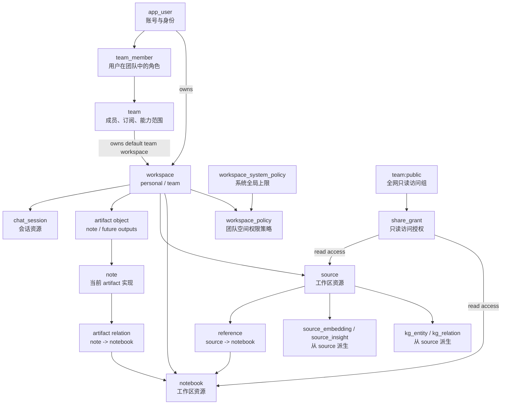

# Workspace Permission Model

> Status: 权限闭环基准
> Last updated: 2026-05-06

本文档定义 Lumina workspace 阶段的对象关系和权限归属规则。它是后续修复、迁移和重构权限逻辑时的判定基准。

核心原则：

> 资源归属只看 `workspace_id`；分享只授予访问权，不改变归属。

这条原则优先级高于历史上的 `owner_id + visibility + share_grant` 拼接逻辑。任何列表、详情、写操作和 UI 分组都应先判断当前语义是“归属范围”还是“访问范围”。

---

## 1. 对象关系图



---

## 2. 权限不变量

### 2.1 Home Workspace

每个业务资源必须有且只有一个 home workspace。

必须拥有 `workspace_id` 的对象：

- `notebook`
- `source`
- `note`
- `chat_session`
- 后续新增的 `artifact`

派生对象继承父对象权限，不单独建立 workspace：

- `source_embedding` 继承 `source`
- `source_insight` 继承 `source`
- `kg_entity` / `kg_relation` 继承其 `source_id` 指向的 `source`

### 2.2 Share Is Read Access

`share_grant` 只表示“谁可以读这个资源”。

它不能：

- 改变资源的 `workspace_id`
- 让资源出现在目标 workspace 的资源列表中
- 赋予编辑、删除、移动、处理、重新生成 KG 等写权限

分享给团队的来源应出现在“共享给团队的内容”或 notebook 引用上下文中，而不是出现在团队 workspace 的来源列表中。

### 2.3 Reference Is Usage

`reference` 表示 notebook 使用了某个 source。

它不能：

- 改变 source 的归属
- 赋予 notebook owner 对 source 的删除权
- 赋予 notebook workspace 对 source 的管理权

因此 notebook 内来源列表可能包含外部 source。显示时可以展示，但操作按钮必须按 source 自己的 home workspace capability 判断。

### 2.4 Move And Copy Are Ownership Events

只有以下操作可以改变或产生资源归属：

- `move`: 修改现有资源的 `workspace_id`
- `copy`: 创建新资源副本，并分配新的 `workspace_id`

分享、引用、公开发布都不是归属事件。

---

## 3. 对象职责边界

### User

User 表示账号身份。

负责：

- 登录与 profile
- 系统角色：`admin | user`
- personal workspace 的默认归属

不负责：

- 团队资源协作权限
- 资源列表归属

### Team

Team 表示组织和能力边界。

负责：

- 成员关系和角色：`owner | admin | member | viewer`
- 订阅、席位、团队状态
- 系统管理员授权的可用模型和可用转换
- 团队默认模型和团队设置

不负责：

- 直接承载 notebook/source/note/chat
- 通过 share grant 表达资源归属

### Workspace

Workspace 是资源归属和协作边界。

负责：

- 业务资源归属
- 工作区内读写能力
- move/copy 生命周期
- workspace policy
- 资源列表的“本空间内容”范围

workspace 类型：

| Type | 说明 |
| --- | --- |
| `personal` | 用户个人空间。每个用户至少一个。 |
| `team` | 团队空间。属于一个 team。 |

Public 不建成 workspace。Public 是全网只读传播状态。

### Resource

当前资源对象包括：

- `notebook`
- `source`
- `note`
- `chat_session`

长期方向是引入统一 `artifact` 抽象，`note` 是 artifact 的一种实现；artifact 可由外部 API、插件或内部转换产生，也可以转换为 source。

### Share Grant

`share_grant` 表示访问授权。

当前阶段只支持 `read` 语义。即使字段中保留 `write | owner` 兼容值，新权限模型也不应依赖它们表达写权限。

### Visibility

`visibility` 是展示和兼容字段，不是权限根。

建议语义：

| Value | 含义 |
| --- | --- |
| `private` | 未公开，未分享给非 home workspace 主体。 |
| `team` | 存在团队 read grant。 |
| `public` | 存在 `team:public` read grant。 |

长期建议让 `visibility` 可由 grants 派生或通过服务层维护一致，避免它和 `share_grant` 冲突。

---

## 4. 角色与能力

### 系统管理员

系统管理员负责系统配置和观察。

可以：

- 查看所有用户、团队、workspace 和业务资源
- 管理系统模型、转换、设置、高级配置、审计日志
- 管理用户和团队基础配置

不能：

- 替用户创建、编辑、删除业务资源
- 替用户移动资源
- 替资源 owner 创建或撤回分享

例外：

- admin 自己 personal workspace 内的资源，按普通 owner 规则处理。

### Personal Workspace Owner

可以：

- 管理自己 personal workspace 内资源
- 分享自己的资源
- 移动自己的资源到有权限写入的 team workspace

### Team Owner / Team Admin

可以：

- 管理团队成员
- 管理团队默认模型和团队设置
- 管理 team workspace 内资源
- 配置 workspace policy

不能：

- 管理其它 workspace 的资源
- 仅因为某个外部资源被分享给团队，就编辑或删除该外部资源

### Team Member

默认可以：

- 查看 team workspace 内容
- 新增来源
- 新增笔记
- 查看其它成员创建的 notebook/source/note

默认不能：

- 删除团队资源
- 移除其它成员创建的来源
- 编辑其它成员创建的笔记
- 管理分享和 workspace policy

具体能力由 `workspace_system_policy` 上限和 `workspace_policy` 共同限制。

### Anonymous User

只能读取 public 内容。

---

## 5. 权限计算顺序

统一公式：

```text
effective_capability =
  resource_home_workspace
  + actor_workspace_role
  + system_policy_limit
  + workspace_policy
  + creator_condition
  + share_read_grant
```

计算顺序：

1. 读取资源的 `workspace_id`。
2. 解析 actor 对该 workspace 的角色。
3. 判断 actor 是否为系统 admin。
4. 判断 actor 是否为资源 creator/owner。
5. 读取系统上限和 workspace policy。
6. 读取 share grant，仅用于补充 `can_read`。
7. 输出统一 `ResourceCapabilities`。

重要约束：

- `share_grant` 只能影响 `can_read`。
- `visibility = public` 只能影响 `can_read`。
- `owner_id` 可以影响 personal workspace 内的 creator/owner 能力，但不能单独把资源归入团队。
- 系统 admin 的观察权只影响 `can_read`，不影响写能力。

---

## 6. 列表契约

### Workspace Scope

Workspace scope 表示“这个空间自己的内容”。

```http
GET /sources?workspace_id={workspace_id}
GET /notebooks?workspace_id={workspace_id}
```

必须只返回：

```text
resource.workspace_id = workspace_id
```

不应包含：

- 分享给该团队但 `workspace_id` 不属于该团队 workspace 的资源
- public 资源
- 当前用户在其它 workspace 拥有的资源

### Access Scope

Access scope 表示“当前用户可读的一切内容”。

可以包含：

- actor 自己 personal workspace 内容
- actor 所属 team workspace 内容
- 显式分享给 actor 的内容
- 显式分享给 actor 所属 team 的内容
- public 内容

这种列表必须在 API、服务和 UI 命名上明确为 `accessible` 或 `shared`，不能复用 workspace 列表语义。

### Public Scope

```http
GET /sources/public
GET /notebooks/public
```

只返回 public 内容。Public 内容保持原 `workspace_id`，不会进入当前用户 workspace。

### Notebook Context Scope

Notebook 内 source 列表由 `reference` 决定：

```text
reference.out = notebook_id
```

该列表可能包含外部 source。UI 应显示其原始归属或共享状态，并按 source capability 控制操作按钮。

---

## 7. 写操作契约

### Create

创建资源必须确定目标 workspace。

规则：

- 未指定 `workspace_id`：默认进入 actor personal workspace。
- 指定 `workspace_id`：actor 必须是该 workspace 成员。
- 创建者记录为 actor。

### Update

更新资源要求：

- actor 是 personal workspace owner，或
- actor 是 team workspace manager，或
- workspace policy 允许成员编辑自己创建的资源。

### Delete

删除资源要求：

- personal workspace owner 可删除自己的资源。
- team workspace manager 可按策略删除团队资源。
- team member 默认不能删除团队资源。
- 外部共享资源不能由被分享方删除。

### Share

分享资源要求：

- actor 是资源 owner，或
- actor 是资源 home workspace manager。

系统 admin 只能查看分享状态，不能替 owner 管理分享。

### Move

移动资源要求：

- actor 可管理源资源。
- actor 可写入目标 workspace。
- 系统记录审计事件。
- 移动后资源完全受目标 workspace policy 管理。

### Copy

后续能力。Copy 创建新资源副本并分配新的 `workspace_id`，不应伪装为 share。

---

## 8. 前端分组规则

页面应明确区分三类内容。

| 分组 | 数据来源 | 操作权限 |
| --- | --- | --- |
| Workspace 内容 | `resource.workspace_id = currentWorkspaceId` | 按 home workspace capability |
| 共享给我/团队 | `share_grant` / access scope | 默认只读 |
| Public 内容 | public endpoint | 只读，可引用 |

不要把共享内容混进 workspace 内容分组。这样用户才能理解“这是团队知识库自己的资源”还是“团队可以读的外部资源”。

---

## 9. 当前代码收口清单

### 必须收口

- 所有 repository list 查询区分 `workspace scope` 和 `access scope`。
- 所有 router 写操作统一调用 capability/service，不再在 router 内手写 owner/visibility fallback。
- `SourceRepository` 和 `NotebookRepository` 的 workspace 查询契约保持一致。
- notebook 内 source 列表显示外部来源时，操作按钮使用 source capability，而不是 notebook capability。
- DB 清理脚本或 migration 保证所有业务资源都有 `workspace_id`。
- KG、embedding、insight 清理跟随 source 生命周期。

### 应该收口

- 引入 `PermissionService` 或 `ResourceAccessService`，集中提供：
  - `can_read(resource, actor)`
  - `capabilities(resource, actor)`
  - `list_workspace_resources(workspace_id, actor)`
  - `list_accessible_resources(actor)`
- 将 `visibility` 改为由 share grants 维护的一致字段，避免手工漂移。
- 为 share grant 增加影响预览，区分 revoke public 和 revoke team。
- 为 workspace move 增加更完整的影响预览。

### 后续演进

- 引入统一 `artifact` 表或 domain abstraction。
- 支持 artifact 转 source。
- 支持 workspace export/import，并明确包内资源归属重建规则。
- 支持 copy 副本接口。

---

## 10. 验收用例

权限闭环至少覆盖以下场景：

1. 独立用户只能在 personal workspace 列表中看到自己的资源。
2. 独立用户可以在 public/shared 分组看到被分享资源，但不能在 personal workspace 内容中看到它们。
3. 团队成员在 team workspace 列表中只看到 `workspace_id` 属于该 team workspace 的资源。
4. 分享给团队的外部 source 不进入 team workspace 来源组。
5. notebook 引用外部 source 时，source 可读但不可由 notebook owner 删除。
6. team member 可以新增团队来源和笔记。
7. team member 不能删除团队资源。
8. team owner/admin 可以管理 team workspace 内资源。
9. system admin 可以观察所有资源，但不能编辑、删除、移动或分享别人的业务资源。
10. public 撤回不移动资源，不破坏已有只读引用。

---

## 11. 实施顺序建议

1. 固化查询语义：workspace scope 和 access scope 分离。
2. 建立统一 permission service，逐步替换 router 内散落判断。
3. 补齐 DB invariant 检查和修复工具。
4. 调整前端分组和文案，明确 workspace/shared/public。
5. 增加跨对象权限矩阵测试。
6. 再推进 artifact、export/import、copy 等演进能力。
